# PV-Power-Forcast

Solar plants energy forecast example

## Preword

Predicting expected energy on an hourly basis is best done by using skycams to observe the sky in the field and using trained networks to calculate a forecast. There are also several online services that predict the amount of energy directly from site data. Unfortunately, the data is very coarse and it is difficult to refine the model afterwards, e.g. to take into account the characteristics of the environment. There are still very few weather services that provide the necessary values for an own calculation. And even fewer whose data are somewhat reliable. In this repository you will find some suggestions to make your own calculations with different forecast data.

## Calculation via DNI GHI DIF

See the 'DNI_GHI_DIF.js' example for the basics of calculating performance using DNI / GHI / DIF

## Calculation via cloud cover

See the 'cloudcover.js' example for the basics of calculating performance using cloud cover prediction.

## Graphical representation of the values

It is extremely helpful to plot the values graphically to make optimizations or detect errors. My recommendation is to either use existing tools or create an svg with <https://echarts.apache.org/>.

## Node-Red / MQTT / Wordpress

I use a combination of different tools to display the graphics on my website in real time. It is a very special setup but I would like to describe it.
Node-Red retrieves the data from meteoblue. I use selected short term models from the MultiModel forecast for the current day and others for a 3 day forecast. The advantage of the MultiModel forecast is that I can choose the best fitting models for the region. In short and long term. Then a graph is rendered with the node-red-contrib-echarts node which is sent via MQTT.
In Wordpress I use the plugin 'DIOT SCADA with MQTT' to include the SVG file in real time. For this my MQTT broker has a read-only public area and a letscrypt SSL certificate. So it can display the data on my HTTPS secured wordpress site.

